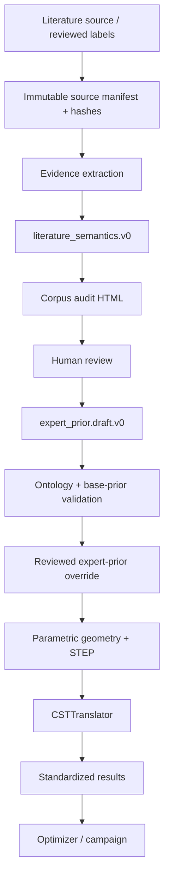
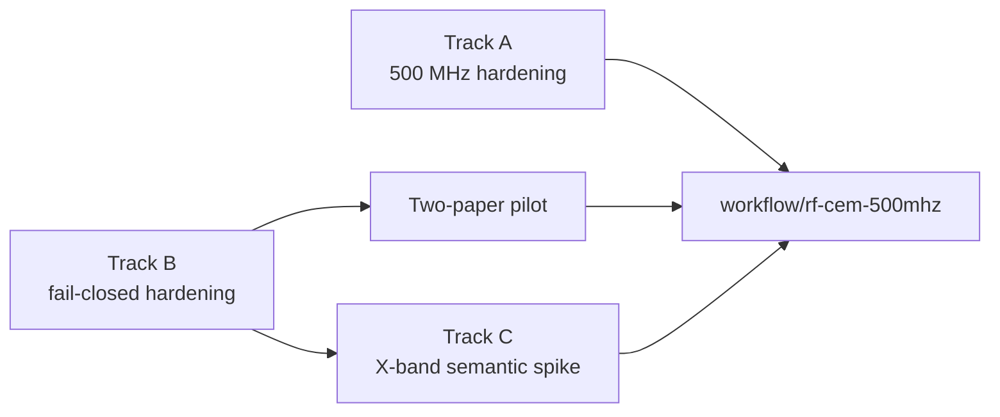

# RF-CEM 路线图 V3：稳定单腔闭环后的并行研发计划

- 状态基线：2026-07-10
- 适用分支：`workflow/rf-cem-500mhz` 及其 RF-CEM 实验分支
- 文档定位：用当前代码与实际运行证据更新 V2 历史计划，作为后续开发、验收和 agent 交接的共同基线。

## 1. 执行摘要

RF-CEM 500 MHz 单腔已经完成从专家先验、12 维参数化曲线、STEP 生成、
CSTTranslator，到 Tetrahedral eigenmode 求解及 Frequency、R/Q、Q 回读的
闭环验证。工作站第一轮 seeded SAO campaign 共完成 60 次评估，60/60 为
`SUCCESS`。这说明当前主要问题已不再是“闭环能否运行”，而是如何把它收口为
可恢复、可审计、目标函数符合物理意图且可迁移的工程流程。

因此，RF-CEM 可以从单线开发转入三条并行路线：

- Track A：500 MHz campaign hardening，负责目标函数、历史 seed、恢复和运行安全。
- Track B：literature semantics hardening，负责论文发现、证据抽取、语义生成和总审计 HTML。
- Track C：X-band 2.3-cell semantic spike，验证现有语义契约能否覆盖多 cell、阴极、耦合器和局部高场对象。

三条路线共享版本化的设计包、证据和审计约定，但不共享未经证明的具体实现。
RF-CEM 专属代码继续留在 canonical RF-CEM workflow 分支及其实验分支中；只有
具有稳定跨 workflow 契约且已有第二个真实消费者的模块，才讨论提级到严格隔离的
`main`。

本路线图依据以下证据编写：

- 历史计划：本地输入 `Future Work/rf_cem_technical_report_ver2.md`。
- 当前几何状态：[rf_cem_parametric_geometry_status.zh.md](rf_cem_parametric_geometry_status.zh.md)。
- 工作站实跑交接：[rf_cem_workstation_agent_handoff_2026-07-09.md](rf_cem_workstation_agent_handoff_2026-07-09.md)。
- 项目总状态：[PROJECT_STATUS_CONTEXT.md](PROJECT_STATUS_CONTEXT.md)。
- 当前代码、测试和 Git diff。

证据发生冲突时，优先级为：

```text
当前代码与测试
  > 最新的工作站运行记录和 handoff
  > 最新 status 文档
  > V2 历史计划
```

## 2. 范围与非目标

### 2.1 当前范围

- 常温 500 MHz、轴对称、单腔 RF vacuum 参数化几何。
- 主模 Frequency、R/Q、Q 及派生 shunt impedance
  `R = (R/Q) * Q`；其中 R/Q 与 R 的单位均为 ohm。
- reviewed feature labels、expert prior、参数化几何、STEP、CSTTranslator、
  eigenmode solver 和结果回读之间的可追溯链路。
- 论文到可审计语义草案的辅助接口。
- X-band 2.3-cell 的导入式语义建模和 dry-run mapping。

### 2.2 当前非目标

- 让自然语言、论文正文或图片像素直接生成 STEP、CST 指令或优化参数。
- 让未审核的 literature semantics 自动合并到生产 expert prior。
- 在 X-band 首轮 spike 中立即进行几何生成或优化 campaign。
- 在当前路线中加入 HOM、wakefield、multipacting、thermal、structural、
  cooling 或完整 coupler 优化。
- 为尚未使用的求解器提前实现 HFSS、ACE3P、COMSOL 等抽象层。
- 立即开发完整自研 CAD/混合几何内核。
- 为了“通用化”把 RF-CEM 专属代码提前复制或提级到 `main`。

## 3. 统一编号和成熟度模型

V2 同时使用了 Phase 1A/1B/1C、Stage 1–7 和 P0–P11，容易把工作拆分、能力
成熟度和长期架构目标混为一谈。V3 使用三套正交标识：

- 功能成熟度：`FM0`–`FM4`。
- 架构合规度：`AC0`–`AC4`。
- 工作路线与验收门：`Track A/B/C`、`A-G1/B-G1/C-G1` 等。

### 3.1 功能成熟度

| 等级 | 定义 | 最低证据 |
|---|---|---|
| `FM0` | 概念或文档 | 范围、接口草案或人工流程 |
| `FM1` | no-CST 原型 | 可运行 CLI/模块和自动测试 |
| `FM2` | 单点真实验证 | 至少一个真实输入或一次受控 live-CST 证据 |
| `FM3` | 可重复批处理 | campaign/批处理成功，记录可追溯 |
| `FM4` | 可运营 | 可移植、可恢复、幂等，且有明确运维契约 |

### 3.2 架构合规度

| 等级 | 定义 | 最低证据 |
|---|---|---|
| `AC0` | 隐式或手工约定 | 依赖个人操作或未记录工程状态 |
| `AC1` | 接口显式化 | schema、类型、单位和 ownership 明确 |
| `AC2` | 可审计 | provenance、validation、失败语义和 diff 可检查 |
| `AC3` | fail-closed 且可恢复 | 冲突阻断、幂等、resume 和 collision guard |
| `AC4` | 稳定复用 | 版本化兼容策略和至少两个真实消费者 |

`FM` 与 `AC` 不能互相替代。例如，60/60 campaign 可以证明功能进入 `FM3`，
但若复用输出目录仍可能覆盖候选，则运行生命周期仍未达到 `AC3`。

## 4. 当前成熟度基线

| 能力 | FM | AC | 当前结论 |
|---|---:|---:|---|
| 500 MHz Design Package | FM3 | AC2 | campaign 可用，但契约仍偏单案例 |
| reviewed labels / expert prior | FM2 | AC2 | 有 schema、resolved prior 和来源记录 |
| 参数化几何与 CadQuery/OCP | FM3 | AC2 | 12D 链路稳定；NURBS 必要时 sampled fallback |
| CSTTranslator | FM3 | AC2 | 当前 Tetrahedral eigenmode 路径已验证 |
| Result Parser | FM3 | AC2 | Frequency、R/Q、Q 稳定；Epk/Hpk 未闭环 |
| Optimizer Bridge | FM3 | AC2 | 60/60 成功；objective、seed、resume 未收口 |
| Cavity Grammar | FM1 | AC1–2 | 仅 axisymmetric single-cell v0 |
| Literature Semantics | FM2 | AC2 | 两篇固定版本论文 pilot、fail-closed draft 和总审计 HTML 已完成；用户 patch 审核待做 |
| X-band 2.3-cell | FM0 | AC0 | 尚未开始真实案例 |
| RF 扩展与多物理场 | FM0 | AC0 | 明确延后 |

较早 status 中“面向优化器的批量 live-CST evaluator 尚未进入小规模参数扫描”的
描述，已被 2026-07-09 的 60/60 campaign 证据取代。该历史描述只用于理解演进，
不得作为当前状态。

## 5. V2 任务映射与完成判断

| V2 项目 | V3 状态 | 说明 |
|---|---|---|
| P0 DesignPackage v0 | 部分完成 | 500 MHz 实例已工作，尚未形成跨案例稳定契约 |
| P1 FeatureGraph v0 | 部分完成 | reviewed labels 与 prior 已接入，face/port binding 仍有限 |
| P2 Simulation/Boundary/Mesh Recipe | 部分完成 | 当前路径已显式化一部分，仍依赖历史模板证据 |
| P3 500 MHz baseline 复现 | 基本完成 | Frequency、R/Q、Q 已闭环；Epk/Hpk 和正式容差未完成 |
| P4 CSTTranslator v0 | 当前单腔范围完成 | STEP、材料、Tetrahedral eigenmode 和结果模板路径已验证 |
| P5 ResultParser v0 | 部分完成 | 三项标量稳定，尚非完整通用结果契约 |
| P6 Optimizer Bridge | 已进入 campaign | 从“能运行”转入 objective、seed、resume hardening |
| P7 X-band 2.3-cell | 未开始 | 作为 Track C 启动 |
| P8 GeometryBackend | 当前范围完成 | 已覆盖轴对称单腔 |
| P9 OCC/CadQuery | 已接入 | 使用隔离 worker；保留 fallback provenance |
| P10 Grammar Library | 起步 | 只有首个单腔设计族 |
| P11 自研混合内核 | 延后 | 当前没有足够收益证明其优先级 |

## 6. 目标架构与安全边界



边界规则：

1. 论文、图片和自然语言始终是 evidence，不是 executable geometry。
2. 只有 ontology 白名单允许的 `target_path` 与 `value` 才能进入 reviewed override。
3. `reviewed_feature_labels` 和 baseline geometry 的优先级高于文献证据。
4. normal-conducting 与 superconducting 分支必须隔离；冲突时阻断生成或合并。
5. 单篇文本证据默认是 soft；image-only 证据只能支持 motif-level 语义。
6. CST 操作继续只使用仓库中已有验证 wrapper 和用户提供的官方证据。
7. 原始论文、图片、CST 工程和 campaign 结果是本地输入/产物，不进入 Git。

## 7. Track A：500 MHz Campaign Hardening

Track A 保留现有 `free_equator_smooth` 与 `exploratory_12d` 基线，目标是把当前
`FM3/AC2` 的 campaign 提升到可安全重复运行的 `FM4/AC3`。

### A-G1：candidate 039/046 完整审计

在工作站只读检查两组候选的：

- `parametric_geometry.v0.json`；
- `geometry_validation.json`；
- `parametric_geometry_audit.html`；
- `generated_vacuum.step`；
- live postprocessing diagnostic；
- 对应 CST project 和 mode 结果。

Done Definition：

- 对尖角、自交、细颈、曲率异常和 sampled fallback 做明确判断。
- 记录人工接受/拒绝理由。
- 确定 candidate 039、046 或两者都不适合作为下一轮 seed。
- 不仅凭 Frequency/R/Q/Q 三个标量决定几何可接受性。

### A-G2：目标函数与历史 seed

目标函数必须明确使用 MHz、ohm 和无量纲归一量。建议语义：

```text
490 MHz <= f <= 510 MHz:
  frequency penalty = 0 或明确配置的弱惩罚
otherwise:
  frequency penalty = distance to nearest window boundary

主要收益：R/Q 与 R = (R/Q) * Q
Q：soft floor，不作为无限增大的直接奖励
novelty：可选且权重必须低于主要 RF 指标
```

Done Definition：

- 对 490、500、510 MHz 以及窗口两侧边界编写单元测试。
- objective 权重、窗口和 Q floor 进入版本化配置。
- 支持 `--seed-record-path` 与 `--seed-record-index`。
- seed 加载重新校验 schema、参数名、单位、维度、bounds 和有限值。
- 输出 source record、参数向量和文件 hash，保证 seed 可追溯。
- 不允许把 quick-scan candidate index 与 live record index 静默混用。

### A-G3：安全恢复与输出生命周期

Done Definition：

- 默认拒绝复用包含 campaign 数据的输出目录，除非显式 `--resume`。
- resume 从现有记录恢复下一 candidate index 和 optimizer 状态。
- 不覆盖已有 candidate package、CST project 或 diagnostic report。
- 不重复追加同一 evaluation record。
- JSONL、summary、SAO result、candidate directory 和 project path 可相互校验。
- 中断后可以从最后一个完整记录恢复；不完整记录有显式状态。
- 运行锁和失败状态不能由 agent 猜测删除。

### A-G4：验证与扩大 campaign

- 先运行 branch-local 全量 no-CST suite。
- 在全新输出目录进行 20 次 live-CST smoke；目标为 20/20、零覆盖、零重复。
- smoke 通过并审计候选后，再决定扩大至 120 或 200 次。
- 每轮保留 `live_records.jsonl`、`live_summary.json`、`sao_result.json` 和环境摘要。
- no-CST 与 live-CST 结果必须分开记录，不能互相替代。

## 8. Track B：Literature Semantics Hardening

Track B 不占用 CST 许可证，可以与工作站 campaign 完全并行。首轮目标不是自动
“学习几何”，而是从两篇人工确认、固定版本的一手论文生成可重复、可审计且默认不执行的
语义包与 corpus 级总审计 HTML。

### B-G0：合并前安全门（本分支已通过）

在自动下载或允许 reviewed merge 前，必须解决：

- `operating_regime` 与 cavity family 冲突时 fail closed；例如 SRF 请求不能静默
  路由到 normal-conducting nose-cone grammar。
- 每个 patch 的审核状态绑定到它直接依赖的 evidence；一个无关 `accepted` 项不能
  让其他 `rejected` 或 `pending` 项变成 accepted。
- `merge-prior` 重新验证 `target_path` 和 `value` 的 ontology/base-prior
  compatibility，而不只检查路径。
- HTML、YAML 和 CLI 统一使用真实状态枚举：`pending`、`accepted`、
  `accepted_as_soft_only`、`rejected`、`needs_more_evidence`。
- 所有论文标题、作者、正文、图注和语义字段输出到 HTML 前进行 escaping。
- image-only numeric claim 永远不能成为 hard executable rule。

当前 `codex/rf-cem-literature-semantics-hardening` 已实现上述安全门，并增加
semantic/base/draft hash 绑定、curve-region 一致性和多论文 provenance 保留。
这只表示实现门通过；在用户逐 patch 审核前，仍不得把 draft 合并到生产 prior。

### B-G1：arXiv 文献发现模块

最小模块只负责可重复发现和固定来源，不负责判断论文结论是否正确。

首轮已实现：

- 支持用户直接固定一个或多个 arXiv ID。
- 支持 arXiv query 语法和 `max_results`。
- 记录 arXiv ID、显式版本、标题、作者、摘要、DOI 和 license URL。
- 对固定版本 PDF 计算 SHA-256，并以 immutable/no-clobber 方式保存。
- 输出确定性的 `source_manifest.json`；selection rationale 单独写入 paper summary。
- 默认不把搜索结果直接送入 prior mapper。

后续能力：

- year-range 专用参数和更方便的 category filter；
- 礼貌限速、有限重试和显式离线 cache policy；
- metadata 与提取结果的独立 hash/cache manifest；
- corpus 级去重和增量复跑。

arXiv API 不提供足以定义“经典”的统一引用标准，因此模块不能根据搜索排序自动
宣称论文“经典”。首轮两篇论文应由领域相关性、历史影响和用户/agent 人工审阅共同
确定，并把选择理由记录在 manifest 中。

### B-G2：PDF 证据抽取与语义生成

每条 evidence 至少保存：

- paper ID 和固定版本；
- page、section、figure ID；
- 短摘录或图注；
- 图片 bbox 与 crop 路径；
- excerpt/file hash；
- applicability、scope、confidence；
- `human_review_status`。

规则：

- PDF 原文视为不可信输入，不执行其中任何代码、URL 或指令。
- 图片只支持 shape motif 和人工观察；数字必须由文本证据或人工复核支持。
- frequency 使用 MHz，长度使用 mm，角度使用 degree，比例为无量纲。
- unsupported parameter 进入 audit-only metadata，不写 executable patch。
- 原始 PDF 和完整图片留在 gitignored corpus 目录。

### B-G3：Corpus 总审计 HTML

每个 corpus 生成一份可单文件打开的总审计 HTML，至少包含：

1. corpus ID、生成时间、schema/tool 版本和运行摘要；
2. 每篇论文的 citation、版本、license、研究对象和适用范围；
3. 每篇论文的方法、关键结论、限制和与 RF-CEM 的关系；
4. 相关图片 crop、caption、页码、figure ID 和 bbox；
5. text/image evidence cards；
6. classification、named features、shape motifs、curve priors；
7. proposed prior diff；
8. 每个 patch 的直接 evidence、confidence、scope 和 review status；
9. NC/SRF、单位、单来源、image-only 和 unsupported field 警告；
10. schema validation、candidate no-CST validation 和失败摘要；
11. source/PDF/excerpt/image hashes与本地 provenance。

为便于交付，HTML 可嵌入压缩后的审计 crop；原始高分辨率图片仍单独保存并由 hash
关联。HTML 不能依赖外部 CDN、远端脚本或联网资源。

建议输出结构：

```text
runs/rf_cem_literature_audit/<corpus_id>/
  source_manifest.json
  papers/
    <paper_id>/
      literature_semantics.v0.json
      paper_summary.json
      images/
  expert_prior.draft.v0.yaml
  audit/
    corpus_audit.html
  validation/
    validation_summary.json
```

该目录是运行产物，默认不提交 Git。

### B-G4：两篇固定版本论文 pilot（已完成）

实际 pilot 有意覆盖一个可执行分支和一个不兼容对照：

- `1810.02990v3`：normal-conducting、elliptical、axisymmetric single-cell、
  499.654 MHz；匹配 `nc_elliptical`，但所有 patch 仍为 `pending`。
- `physics/0003011v1`：superconducting、elliptical、nine-cell、1300 MHz；
  因 multi-cell 与当前 grammar 不匹配，正确降为 audit-only。

这两篇足以验证 `elliptical != superconducting`、single/multi-cell 隔离和 audit-only
路径；它们没有覆盖 `nc_reentrant` 或 `srf_elliptical` single-cell executable 分支。
上述两个分支保留为下一轮补充语料，而不是本轮完成项。SLS-2 论文按直接相关性入选，
不声称它是早期历史经典。

Done Definition：

- 两篇 PDF 可按固定 arXiv version 重复获取，或从 cache 离线复跑。
- 每篇论文生成独立 semantic package，并汇总为一个 corpus HTML。
- NC executable 与 SRF multi-cell audit-only 的 classification、motif 和 patch 不交叉污染。
- 所有 executable patch 初始为 `pending`。
- 未经用户逐项确认，不运行生产性 `merge-prior`。
- adversarial 测试覆盖 regime 冲突、无关 accepted 状态泄漏、非法 value
  篡改、HTML 注入、image-only hard numeric claim 和损坏 PDF。
- branch-local 全量 no-CST suite、`compileall` 和 `git diff --check` 通过。

### B-G5：可选人工合并

只有用户依据总审计 HTML 对 patch 逐项作出决定后，才允许生成 reviewed override。
即使生成 override，也必须先运行 no-CST geometry 与 validation；不得直接启动 CST。

## 9. Track C：X-band 2.3-cell Semantic Spike

Track C 验证的是语义层和 translator dry-run 的表达能力，不是首轮几何优化。

### C-G1：输入和基线冻结

需要用户或工作站提供：

- baseline STEP 或 CST project；
- 几何单位、cell 数、目标频率和 operating regime；
- 已知 cathode、beam exit、coupler、cell boundary 和高场区域；
- 手工 baseline 的结果指标与可接受容差；
- 可合法保存和审计的截图或几何证据。

缺失这些输入时，只能编写 schema fixture，不能宣称完成真实 X-band 验证。

### C-G2：Planned/Resolved Feature Graph

至少表达：

- `CathodeSurface`；
- `GunCell`；
- `HalfCell`；
- `FullCell`；
- `BeamExit`；
- `InputCouplerPort`；
- `HighFieldRegion`；
- `MeshRefinementRegion`。

Done Definition：

- 每个 planned feature 绑定到明确实体，或显式标为 unresolved。
- 每个 resolved feature 保存 selector、source geometry 和 provenance。
- 未解析的 face、port、mesh binding 阻止 translator 执行。
- 现有 CST 工程中的关键手工设置能在设计包中找到对应项。
- 不把 cell、coupler 和边界语义硬编码到 500 MHz 单腔模块。

### C-G3：Dry-run Translator 与后续 live gate

- 生成可审计的 translator payload，但不调用未经验证 CST API。
- 为 resolved/unresolved mapping、单位和失败语义编写 no-CST 测试。
- 首轮不做复杂非轴对称几何生成和优化。
- dry-run 与人工语义审计通过后，再单独定义 live-CST baseline reproduction。
- live gate 的 Frequency、R/Q、field/mode shape 指标和容差必须由用户确认。

## 10. 跨路线依赖与集成门



- Track A 不依赖 literature semantics，可以立即并行。
- Track B 不需要 CST 许可证，也不能以 PDF 处理成功替代物理审核。
- Track C 可以先做输入清点，但应复用 B 固化后的 ontology/schema。
- B/C 合入 canonical RF-CEM 分支前必须基于最新
  `workflow/rf-cem-500mhz` rebase 或重建。
- Track B 的 audit-only 产物不要求 Track A 停止 campaign。
- 任何 literature patch 在 B-G0 和用户审核前都不能进入 Track A 的生产 seed。

统一集成门：

| Gate | 要求 |
|---|---|
| `I-G1` 契约 | schema、单位、ownership、兼容策略明确 |
| `I-G2` 安全 | conflict、invalid value、unresolved binding 均 fail closed |
| `I-G3` 验证 | targeted 与 branch-local no-CST 通过 |
| `I-G4` 审计 | provenance、diff、人工决定和风险记录完整 |
| `I-G5` 实跑 | 仅需 CST 的路线提供受控 live 证据 |

## 11. 分支与 Worktree 策略

不新建独立仓库，也不复制项目目录；每条长期并行路线使用 Git worktree。

| 角色 | Worktree | 分支 | 状态 |
|---|---|---|---|
| 稳定集成 | `C:\Users\lau\cst_ver3_project` | `workflow/rf-cem-500mhz` | 已存在 |
| Campaign hardening | `C:\Users\lau\cst_ver3_rf_cem_campaign_hardening` | `codex/rf-cem-campaign-hardening` | 计划 |
| Literature semantics | `C:\Users\lau\cst_ver3_rf_cem_semantics` | `codex/rf-cem-literature-semantics-hardening` | 已创建 |
| X-band spike | `C:\Users\lau\cst_ver3_rf_cem_xband` | `codex/rf-cem-xband-semantic-spike` | 计划 |

规则：

- 实验分支从最新 canonical RF-CEM 分支创建。
- 只在各自 worktree 中修改所属路线文件。
- 合并前先备份、rebase、运行 branch-local no-CST，并审查生成物。
- `main` 继续保持严格共享核心；RF-CEM 专属 schema、arXiv 下载器、PDF 提取器
  和 corpus audit 不提级。
- 只有接口稳定、有第二个真实 workflow 消费者且无 concrete campaign 行为时，才讨论
  提级至 `main`。
- raw PDF、crop、总 HTML run、CST 工程、JSONL、checkpoints、logs 和本机配置不提交。

## 12. 依赖清单

### 12.1 Track A

- 工作站完整 candidate 039/046 目录。
- CST 2026 library、许可证和已验证模板目录。
- 现有 campaign JSONL 与 SAO result。
- 用户对 objective 权重和 Q soft floor 的最终确认。

### 12.2 Track B

- arXiv 网络访问或固定 PDF cache。
- PDF 文本、图片和页面坐标提取能力。
- 现有 literature semantics schema、ontology、prior mapper 和 audit renderer。
- 用户对两篇论文及每个 patch 的科学审核。

首版优先复用已有环境中的成熟 PDF 解析库；只有现有依赖无法满足页面文字、图片
和 bbox provenance 时，才提出新增依赖，并单独说明许可证、安装和维护影响。

### 12.3 Track C

- X-band 2.3-cell baseline STEP/CST 及合法的本地访问权限。
- face/solid/port 语义和手工 baseline 结果。
- B 路线稳定后的 schema/ontology。
- 后续 live gate 所需 CST 模板和人工容差。

## 13. 风险登记

| 风险 | 级别 | 控制方式 |
|---|---|---|
| NC/SRF 知识串线 | 高 | regime/family conflict fail closed，分支隔离 |
| 单篇论文被当作通用规律 | 高 | single-source 默认 soft，必须逐项人工审核 |
| 图片被误读为数字规则 | 高 | image-only 只支持 motif，数字需文本或人工证据 |
| arXiv 可访问被误认为可再发布 | 中 | 保存 license；raw PDF/crop 默认不提交 |
| PDF 文本或图注注入 HTML/指令 | 高 | 不可信输入、统一 escaping、禁止 eval/代码执行 |
| source 版本漂移 | 中 | 固定 arXiv version、获取时间与 SHA-256 |
| audit HTML 依赖网络资源 | 中 | 单文件离线打开，不使用 CDN/远端脚本 |
| campaign 覆盖候选或重复 JSONL | 高 | 显式 resume、索引恢复、collision guard |
| objective 再次压过真实 RF 偏好 | 高 | window 单测、权重配置、历史数据回放 |
| X-band face/port 映射不稳定 | 高 | unresolved binding 阻断 translator |
| sampled fallback 掩盖曲线意图 | 中 | generation-mode provenance 与几何审计 |
| 本机路径进入 tracked config | 中 | portable example + gitignored local config |
| workflow 过早泛化 | 中 | 第二消费者和稳定契约出现前不提级 |
| 猜测 CST API | 高 | 只复用已验证 wrapper/官方证据 |

## 14. 统一验收标准

每条路线合入前必须满足：

1. 分支和 worktree 身份明确，`git status` 中没有意外产物。
2. schema、单位、物理假设、ownership 和失败语义有文档。
3. targeted tests 与 branch-local 全量 no-CST suite 通过。
4. `compileall` 与 `git diff --check` 通过。
5. schema 变更有版本和兼容说明。
6. 原始输入、CST 结果、PDF、图片、HTML run、JSONL 和本机配置保持 ignored。
7. 生成语义能追溯到 source/page/figure/hash。
8. 科学解释和 geometry patch 仍由用户审核；测试通过不等同于物理正确。
9. live-CST 是否运行单独记录，不得由 no-CST 结果推断。
10. 大改动或远端分支整理前保留可恢复备份。

## 15. 推荐执行顺序

近期优先级：

1. Track B 的 fail-closed 安全门、只读 arXiv discovery/fixed-version ingestion 和两篇论文 pilot 已完成。
2. 下一步由用户审核总 HTML 和 patch；不立即合并生产 prior。
3. 为 `nc_reentrant` 与 single-cell `srf_elliptical` 补充下一轮独立来源。
4. Track A 并行完成 490–510 MHz objective、历史 seed 和 resume/idempotency。
5. Track C 收集 X-band baseline 输入，B 的 schema 稳定后开始 dry-run semantic spike。
6. B/C 产生第二个真实案例前，不扩展通用 grammar，不把 RF-CEM 专属模块提级到 `main`。

下一次更新本路线图的触发条件：

- 两篇论文 pilot 完成并取得人工审核结论；
- 500 MHz 新 objective 完成 20 次 live smoke；
- X-band baseline 输入冻结；
- literature schema 或 expert-prior merge contract 发生版本变化；
- 任一能力的 `FM` 或 `AC` 等级发生变化。
